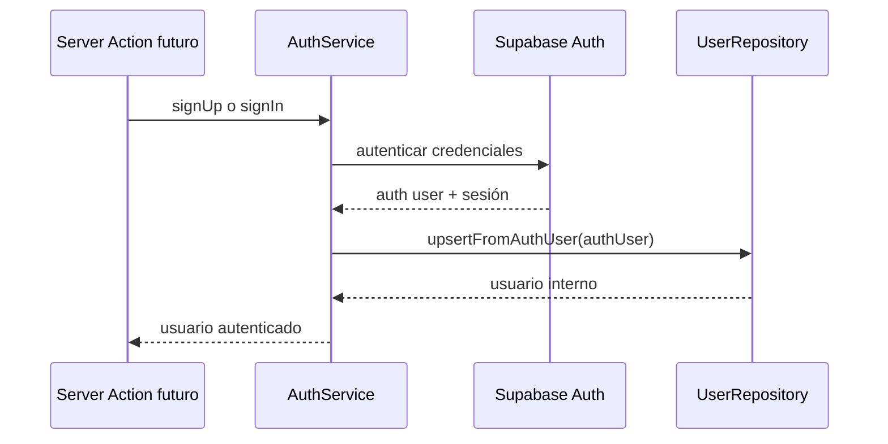
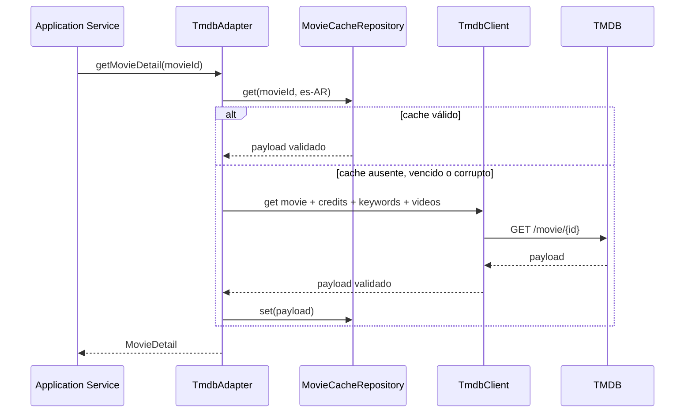

# Design: Foundation Backend

**Estado:** aprobado para planificación

**Fecha:** 18 de agosto de 2026

**Rama objetivo:** `feature/foundation-backend`

**Base:** `origin/develop`

## 1. Objetivo

Construir la infraestructura backend que consumirán las futuras features de Film Match. La entrega incluye Supabase Auth, PostgreSQL, Drizzle, migraciones, repositorios y la integración completa con TMDB.

El trabajo termina en dos fronteras estables:

```text
Application Service
        ↓
Repository
        ↓
Drizzle / PostgreSQL
```

```text
Application Service
        ↓
TmdbAdapter
        ↓
TmdbClient
        ↓
TMDB API
```

## 2. Alcance

### Incluido

- Configuración server-only del entorno.
- Conexiones runtime y de migración a PostgreSQL.
- Clientes Supabase separados para browser y server.
- Renovación de sesión compatible con Next.js 16.
- Operaciones de Auth para email y contraseña.
- Resolución del usuario autenticado sin aceptar `userId` desde el cliente.
- Cinco tablas públicas del MVP.
- Enums, foreign keys, checks, índices, relaciones y RLS.
- Migraciones reproducibles con Drizzle Kit.
- Cinco repositorios de persistencia.
- Cliente HTTP y adapter TMDB.
- Cache descartable de detalles de películas.
- Errores TMDB normalizados.
- Tests unitarios e integración real con Supabase, PostgreSQL y TMDB.
- Documentación de configuración y operación.

### Excluido

- Recommendation Engine.
- Taste Profile, generación de candidatos y ranking.
- Lógica de Discover.
- Chat, LLM y persistencia de conversaciones.
- UI, rutas de negocio, swipe y animaciones.
- Pantallas de login, registro, onboarding, likes, detalle o reviews.
- Watchlist, series, embeddings, pgvector y Collaborative Filtering.
- Acceso directo del navegador a las tablas públicas.

## 3. Decisiones arquitectónicas

### 3.1 Persistencia server-only

Drizzle será la única vía de acceso de la aplicación a PostgreSQL. Las rutas y componentes futuros no importarán tablas ni clientes SQL. Los servicios consumirán repositorios.

Supabase Data API permanecerá desactivada. Las migraciones no otorgarán privilegios a `anon` ni `authenticated`. Cada tabla pública tendrá RLS habilitada como defensa adicional y no tendrá policies mientras no exista acceso mediante Data API.

### 3.2 Separación de conexiones

La aplicación usará dos URLs:

- `DATABASE_URL`: Supavisor Transaction Pooler para el runtime serverless. El cliente `postgres` usará `prepare: false`.
- `DATABASE_MIGRATION_URL`: conexión directa cuando el entorno soporte IPv6 o Supavisor Session Pooler como alternativa IPv4.

Drizzle Kit usará sólo `DATABASE_MIGRATION_URL`. El runtime no importará esa variable.

### 3.3 Auth explícito

Supabase gestionará identidad, contraseña y sesión. La aplicación mantendrá su propio registro en `public.users`.

El flujo de alta hará estas operaciones de forma explícita:

```text
AuthService.signUp
        ↓
Supabase Auth signUp
        ↓
AuthService.ensureUserProfile
        ↓
UserRepository upsert por authUserId
        ↓
Usuario autenticado de aplicación
```

No se crearán triggers sobre `auth.users`. `AuthService` ejecutará `ensureUserProfile` después de un registro o login exitoso. La operación usará un upsert por `authUserId`; así, el login puede reparar una alta parcial sin duplicar registros.

`getCurrentUser()` será de sólo lectura: validará la identidad con `supabase.auth.getUser()` y buscará el usuario interno por `authUserId`. Devolverá `null` cuando no exista autenticación y lanzará un error interno `UserProfileNotProvisionedError` si Auth contiene al usuario pero falta su perfil local. `requireCurrentUser()` convertirá el caso no autenticado en un error estable. Ninguna API futura aceptará `userId` en el request.



### 3.4 Contratos existentes

Los schemas de `src/contracts/` seguirán siendo la fuente de verdad de los DTO de aplicación. La integración TMDB validará su salida contra esos contratos. Los tipos de persistencia se inferirán desde las tablas Drizzle y los tipos de proveedor permanecerán dentro de `src/integrations/tmdb/`.

## 4. Configuración del entorno

El proyecto validará las variables con Zod antes de crear conexiones:

```text
NEXT_PUBLIC_SUPABASE_URL
NEXT_PUBLIC_SUPABASE_PUBLISHABLE_KEY
DATABASE_URL
DATABASE_MIGRATION_URL
TMDB_ACCESS_TOKEN
```

La URL y la publishable key podrán llegar al cliente browser. Las URLs PostgreSQL y el token TMDB serán server-only. El código no registrará secretos, headers de autorización ni cadenas de conexión.

`.env.example` documentará los nombres sin valores reales. Cada desarrollador guardará sus credenciales en `.env.local`, que permanece ignorado por Git.

## 5. Supabase Auth

La infraestructura incluirá:

- Factory browser basada en `createBrowserClient`.
- Factory server basada en `createServerClient` y cookies de Next.js.
- Utilidad de renovación de sesión usada desde `src/proxy.ts`.
- Servicio server-side para registro, login, logout, current user y protección de recursos.
- Errores internos estables para credenciales inválidas, usuario no autenticado y perfil local no disponible.

El proyecto de desarrollo usa email y contraseña con confirmación de correo desactivada. La documentación exigirá confirmación y SMTP propio antes de un entorno productivo.

No se incorporarán OAuth, service-role key ni operaciones administrativas al runtime.

## 6. Modelo de datos

### 6.1 Enums

```text
movie_reaction: LIKE | DISLIKE
review_verdict: RECOMMENDED | NOT_WORTH_IT
```

### 6.2 `users`

| Columna                   | Tipo        | Restricciones                                           |
| ------------------------- | ----------- | ------------------------------------------------------- |
| `id`                      | UUID        | PK, default aleatorio                                   |
| `auth_user_id`            | UUID        | not null, unique, FK `auth.users(id)` on delete cascade |
| `display_name`            | varchar(80) | not null, longitud 1..80                                |
| `avatar_url`              | text        | nullable                                                |
| `onboarding_completed_at` | timestamptz | nullable                                                |
| `created_at`              | timestamptz | not null, default now                                   |
| `updated_at`              | timestamptz | not null, default now                                   |

### 6.3 `user_preferences`

| Columna               | Tipo        | Restricciones                        |
| --------------------- | ----------- | ------------------------------------ |
| `user_id`             | UUID        | PK, FK `users(id)` on delete cascade |
| `preferred_genre_ids` | integer[]   | not null, IDs positivos, mínimo 2    |
| `created_at`          | timestamptz | not null, default now                |
| `updated_at`          | timestamptz | not null, default now                |

La aplicación validará también que los IDs no se repitan mediante el contrato Zod existente.

### 6.4 `user_movie_interactions`

| Columna      | Tipo             | Restricciones                              |
| ------------ | ---------------- | ------------------------------------------ |
| `id`         | UUID             | PK, default aleatorio                      |
| `user_id`    | UUID             | not null, FK `users(id)` on delete cascade |
| `movie_id`   | integer          | not null, positivo                         |
| `reaction`   | `movie_reaction` | not null                                   |
| `watched_at` | timestamptz      | nullable                                   |
| `created_at` | timestamptz      | not null, default now                      |
| `updated_at` | timestamptz      | not null, default now                      |

La tabla tendrá unique `(user_id, movie_id)`. Una película neutral no tiene fila. `upsertReaction` actualizará `reaction` y `updated_at` sin tocar `watched_at`. Eliminar la fila elimina también el estado de vista.

Los índices cubrirán consultas por usuario, reacción y fecha.

### 6.5 `reviews`

| Columna       | Tipo             | Restricciones                              |
| ------------- | ---------------- | ------------------------------------------ |
| `id`          | UUID             | PK, default aleatorio                      |
| `user_id`     | UUID             | not null, FK `users(id)` on delete cascade |
| `movie_id`    | integer          | not null, positivo                         |
| `verdict`     | `review_verdict` | not null                                   |
| `title`       | varchar(30)      | not null, longitud 3..30                   |
| `description` | varchar(400)     | not null, longitud 10..400                 |
| `created_at`  | timestamptz      | not null, default now                      |
| `updated_at`  | timestamptz      | not null, default now                      |

La tabla tendrá unique `(user_id, movie_id)` e índices para listar y contar reviews por película y verdict.

### 6.6 `movie_cache`

| Columna      | Tipo        | Restricciones          |
| ------------ | ----------- | ---------------------- |
| `movie_id`   | integer     | PK compuesta, positivo |
| `language`   | varchar(10) | PK compuesta, not null |
| `payload`    | JSONB       | not null               |
| `fetched_at` | timestamptz | not null               |

Un índice por `fetched_at` permitirá tareas de limpieza futuras sin introducirlas en esta fase.

### 6.7 Timestamps y RLS

Los repositorios actualizarán `updated_at`. El diseño no agrega triggers para timestamps. Las migraciones habilitarán RLS de forma explícita y conservarán los checks relevantes en PostgreSQL.

## 7. Repositorios

Cada repositorio recibirá una conexión Drizzle. Las operaciones no contendrán lógica de UI, recomendación ni orquestación de features.

### `UserRepository`

- `findById`
- `findByAuthUserId`
- `create`
- `update`
- `upsertFromAuthUser`

### `UserPreferencesRepository`

- `findByUserId`
- `create`
- `update`
- `upsert`

### `UserMovieInteractionRepository`

- `findByUserAndMovie`
- `findByUser`
- `findLikesByUser`
- `findDislikesByUser`
- `upsertReaction`
- `setWatched`
- `delete`

`setWatched` sólo modificará una interacción existente. No creará una reacción implícita.

### `ReviewRepository`

- `findById`
- `findByUserAndMovie`
- `findByMovie`
- `create`
- `update`
- `upsert`
- `delete`
- `countByVerdict`

### `MovieCacheRepository`

- `get`
- `set`
- `delete`
- `isExpired`

`isExpired` usará un TTL predeterminado de 24 horas y aceptará otro valor como argumento.

## 8. Integración TMDB

### 8.1 Estructura

```text
src/integrations/tmdb/
├── config.ts
├── client.ts
├── adapter.ts
├── errors.ts
├── schemas/
└── index.ts
```

### 8.2 Configuración

```text
baseUrl: https://api.themoviedb.org/3
language: es-AR
region: AR
includeAdult: false
timeout: 10000 ms
```

`TmdbClient` usará `fetch` nativo y enviará el token como Bearer. No agregará dependencias HTTP ni reintentos automáticos.

### 8.3 Operaciones públicas

```ts
getGenres();
searchMovies({ query, page });
getMovieDetail(movieId);
discoverMovies({ ...filters, page });
getSimilarMovies({ movieId, page });
```

`discoverMovies` traducirá los filtros internos a parámetros TMDB. El método devolverá candidatos normalizados sin calcular afinidad, score ni ranking.

### 8.4 Normalización

- Fecha vacía a `null`.
- Tagline vacía a `null`.
- Runtime ausente o cero a `null`.
- Director: primer miembro de crew con `job = "Director"`.
- Cast: ordenar por `order` y limitar a 20.
- Keywords: limitar a 50.
- Paginación: usar `PAGE_SIZE = 20` y calcular `hasNextPage`.

El adapter validará cada DTO con los contratos existentes antes de devolverlo.

### 8.5 Trailer

El adapter filtrará videos con `type = "Trailer"` y aplicará esta prioridad:

1. Oficial en YouTube.
2. No oficial en YouTube.
3. Oficial en Vimeo.
4. No oficial en Vimeo.

Dentro de cada grupo priorizará español, luego inglés y después otros idiomas. La ausencia de un video compatible producirá `trailer: null`.

### 8.6 Errores

`TmdbClient` convertirá fallos de red, HTTP y validación en un error estable con uno de estos códigos:

```text
UNAUTHORIZED
NOT_FOUND
RATE_LIMITED
TIMEOUT
UNAVAILABLE
INVALID_RESPONSE
```

Los futuros route handlers podrán mapearlos a los códigos públicos existentes sin recibir errores crudos de `fetch` o estructuras del proveedor.

## 9. Cache de detalles

`getMovieDetail()` seguirá este flujo:

```text
Buscar movie_cache por movieId + language
        ↓
¿Existe y no venció?
  sí → validar payload y adaptar
  no → solicitar TMDB, validar, guardar y adaptar
```

Un payload corrupto se ignorará y eliminará antes de consultar TMDB. Un error de escritura del cache no ocultará una respuesta válida del proveedor. Los demás endpoints no usarán `movie_cache` en esta fase.



## 10. Estrategia de pruebas

### 10.1 Suite local sin secretos

- Parser de environment.
- Auth con dependencias controladas.
- Comportamiento de repositorios que pueda probarse sin red.
- Construcción de requests y normalización de errores TMDB.
- Adapter con fixtures de proveedor.
- Director, cast, trailer, fechas, runtime, keywords y paginación.
- Cache válido, vencido, corrupto y fallo de escritura.

Vitest incluirá todos los tests bajo `src/`, no sólo `src/contracts/`.

### 10.2 Suite de integración

`pnpm test:integration` requerirá variables reales y comprobará:

- Conexión a PostgreSQL.
- Aplicación reproducible de migraciones.
- Tablas, enums, constraints, foreign keys, índices y RLS.
- Operaciones de los cinco repositorios.
- Registro, login, current user y limpieza del usuario temporal.
- `getGenres`, `searchMovies`, `getMovieDetail`, `discoverMovies` y `getSimilarMovies` contra TMDB.

Los datos temporales usarán identificadores únicos y se eliminarán al finalizar. La suite fallará con un mensaje claro si falta configuración y no registrará valores sensibles.

### 10.3 TDD y excepciones

El código funcional seguirá ciclos test-first. Archivos de configuración, SQL generado y migraciones quedan fuera del test-first estricto; sus comandos de validación y la integración real aportarán evidencia.

## 11. Comandos operativos

```text
pnpm db:generate
pnpm db:migrate
pnpm db:check
pnpm test:integration
```

La verificación final ejecutará:

```text
pnpm lint
pnpm typecheck
pnpm test:run
pnpm build
pnpm db:migrate
pnpm db:check
pnpm test:integration
```

## 12. Documentación

La entrega documentará:

- Variables de `.env.local` y su origen en cada dashboard.
- Diferencia entre conexión runtime y conexión de migraciones.
- Configuración Auth de desarrollo y requisitos de producción.
- Data API desactivada y acceso server-only.
- Generación, aplicación y revisión de migraciones.
- Ejecución de tests locales e integración.
- Atribución requerida por TMDB.
- Recuperación ante errores de conexión o credenciales.

## 13. Riesgos y mitigaciones

| Riesgo                                 | Mitigación                                                                         |
| -------------------------------------- | ---------------------------------------------------------------------------------- |
| Credencial incluida en Git o logs      | `.env.local` ignorado, schema server-only y revisión del diff antes de cada commit |
| Runtime usa la conexión de migraciones | Variables separadas y módulos de configuración separados                           |
| Alta Auth sin usuario local            | Upsert idempotente y operación explícita de reprovisión                            |
| Tabla pública accesible por error      | Data API desactivada, sin grants y RLS habilitada                                  |
| Cambio inesperado del payload TMDB     | Schemas privados Zod y error `INVALID_RESPONSE`                                    |
| Ausencia de trailer                    | Contrato nullable y selección sin lanzar error                                     |
| Cache corrupto o vencido               | Validar, eliminar y reconstruir desde TMDB                                         |
| Tests dejan datos remotos              | IDs únicos, cleanup en `finally` y reporte explícito si falla                      |

## 14. Criterios de aceptación

La Foundation estará lista cuando otro módulo pueda:

```ts
const user = await getCurrentUser();
const movie = await tmdb.getMovieDetail(157336);
await interactionRepository.upsertReaction(input);
```

sin conocer cookies de Supabase, SQL, autenticación TMDB, payloads del proveedor ni detalles del cache.

La entrega debe demostrar conexión real a Supabase/PostgreSQL y TMDB, migraciones reproducibles, constraints efectivos, repositorios funcionales, errores normalizados y todos los comandos de verificación con resultados informados.
